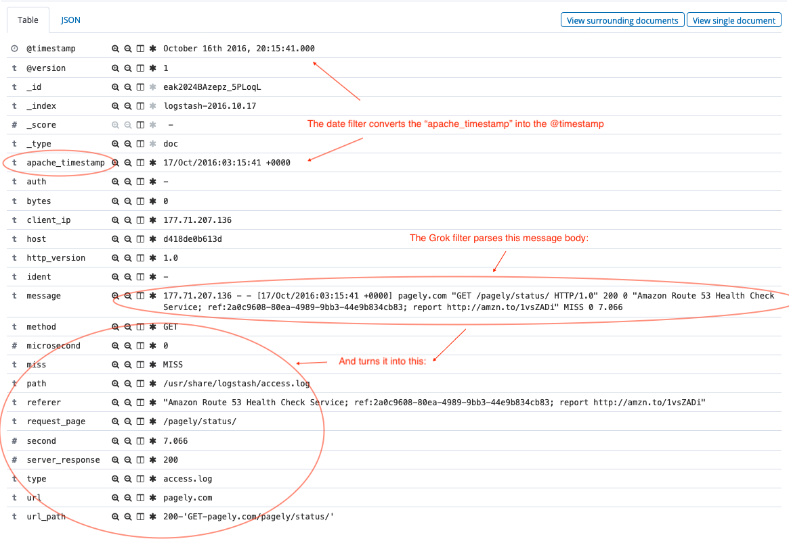
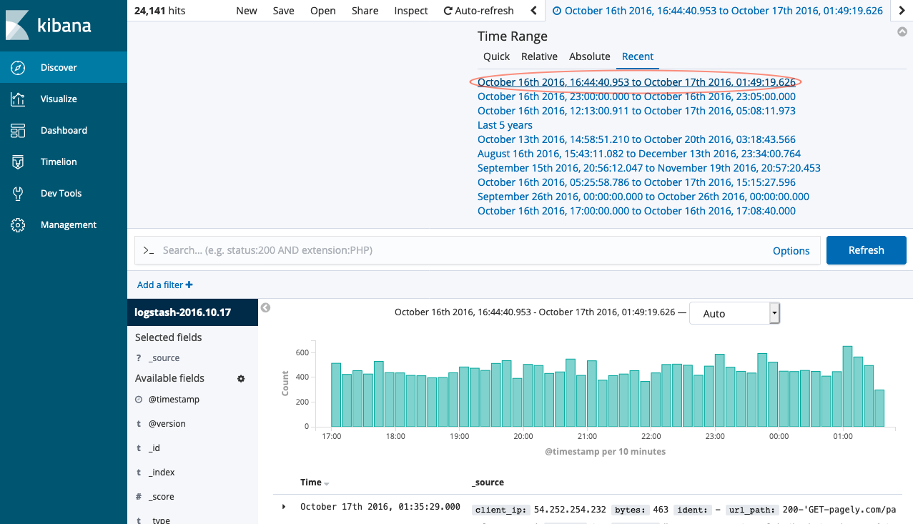
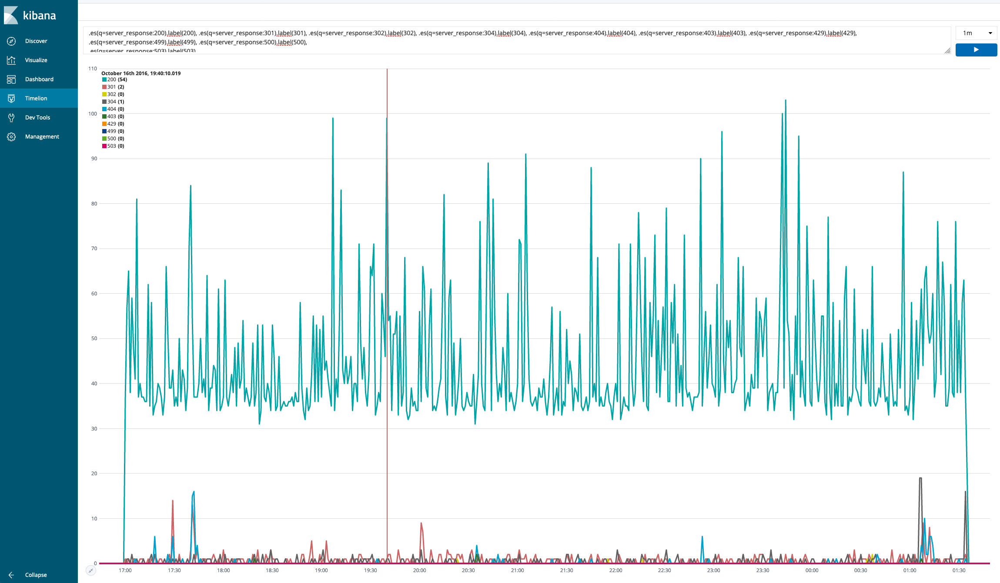
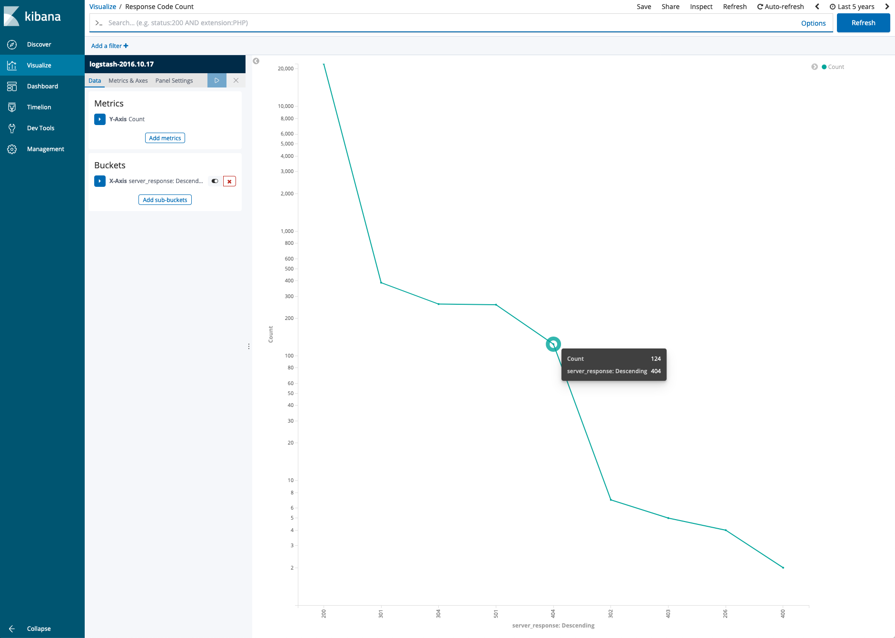
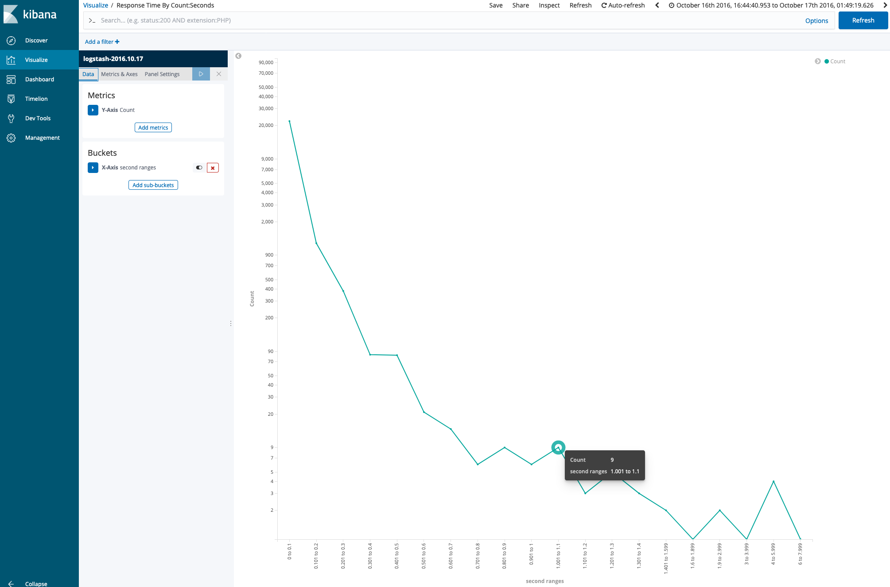
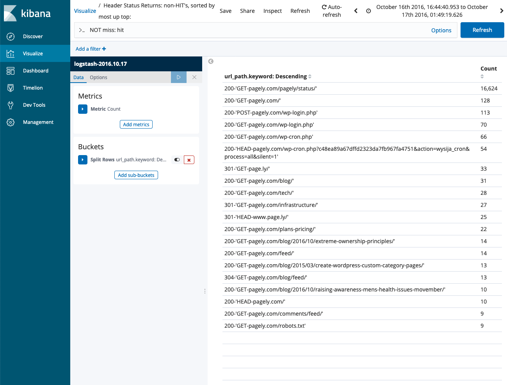
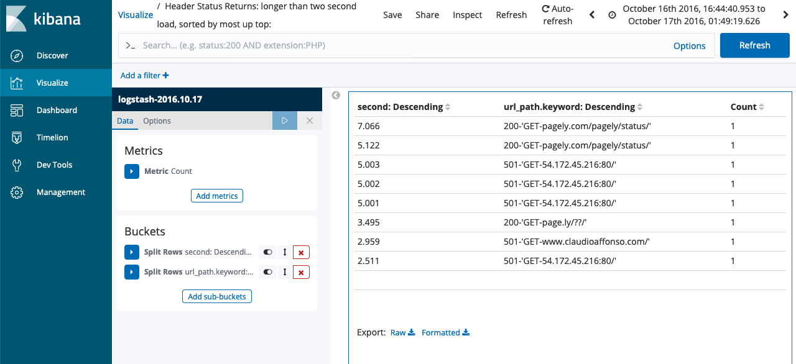
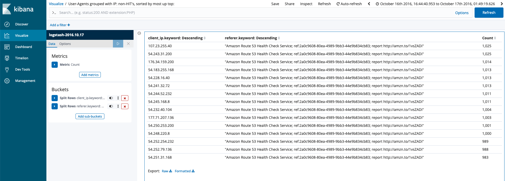
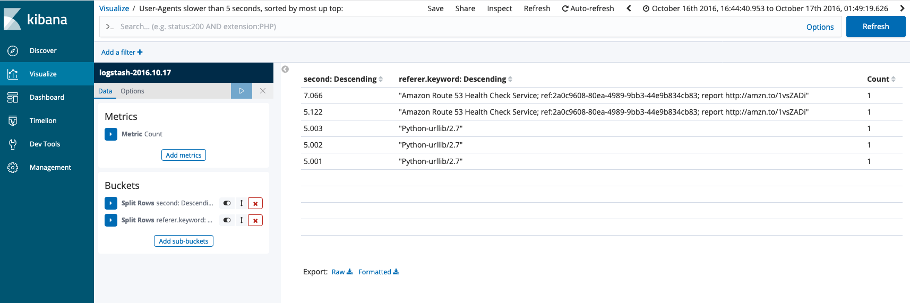

# Dockers-ELK


Run the latest version of the ELK (Elasticsearch, Logstash, Kibana) stack with Docker and Docker Compose.

It will give you the ability to analyze any data set by using the searching/aggregation capabilities of Elasticsearch
and the visualization power of Kibana.

Based on the official Docker images:

* [elasticsearch](https://github.com/elastic/elasticsearch-docker)
* [logstash](https://github.com/elastic/logstash-docker)
* [kibana](https://github.com/elastic/kibana-docker)


# How to setup 

 1.Clone this repository


2. Start the ELK stack using `docker-compose`:

```console
$ docker-compose up
```
# OR

You can also choose to run it in background (detached mode):

```console
$ docker-compose up -d


Give Kibana a few seconds to initialize, then access the Kibana web UI by hitting
[http://localhost:5601](http://localhost:5601) with a web browser.

By default, the stack exposes the following ports:
* 5000: Logstash TCP input.
* 9200: Elasticsearch HTTP
* 9300: Elasticsearch TCP transport
* 5601: Kibana
```

#### GROK Filter query

```
%{IP:client_ip} %{USER:ident} %{USER:auth} \[%{HTTPDATE:apache_timestamp}\] %{GREEDYDATA:url} \"%{WORD:method} %{GREEDYDATA:request_page} HTTP/%{NUMBER:http_version}\" %{NUMBER:server_response:int} %{NUMBER:bytes:int} %{QS:referer} %{GREEDYDATA:miss/hit} %{NUMBER:microsecond:int} %{NUMBER:second:float}
```

#### Timelion Search for Response Codes by Minute

```
.es(q=server_response:200).label(200), .es(q=server_response:301).label(301), .es(q=server_response:302).label(302), .es(q=server_response:304).label(304), .es(q=server_response:404).label(404), .es(q=server_response:403).label(403), .es(q=server_response:429).label(429), .es(q=server_response:499).label(499), .es(q=server_response:500).label(500), .es(q=server_response:503).label(503)
```

## The Process

Mount `access.log` file to container on `docker-compose up`:

```
...
  logstash:
    build:
      context: logstash/
    volumes:
      - ./logstash/access.log:/usr/share/logstash/access.log
...
```


Configure `logstash.conf` to use the provided `access.log` file as its input source:

```
input {
	tcp {
		port => 5000
	}
	file {
		type => "access.log"
		path => "/usr/share/logstash/access.log"
		start_position => "beginning"
	}
}
```

Create grok filters to parse message body into key/value fields searchable from the Kibana UI and replace the default index's `@timestamp` key with date/time parsed from logs: 

```
filter {
	grok {
		match => { "message" => "%{IP:client_ip} %{USER:ident} %{USER:auth} \[%{HTTPDATE:apache_timestamp}\] %{GREEDYDATA:url} \"%{WORD:method} %{GREEDYDATA:request_page} HTTP/%{NUMBER:http_version}\" %{NUMBER:server_response:int} %{NUMBER:bytes} %{QS:referer} %{GREEDYDATA:miss/hit} %{NUMBER:microsecond:int} %{NUMBER:second:float}" }

		## Added url_path field to meet second set of requirements

		add_field => { "url_path" => "%{server_response}-'%{method}-%{url}%{request_page}'" }
	}

    ##  This field replaces the @timestamp key with the timestamp derived from the log file

	date {
		timezone => "America/Phoenix"
    	match => [ "[apache_timestamp]" , "dd/MMM/yyyy:HH:mm:ss ZZ" ]
  	}
}
```



Because we are replacing the `@timestamp` key with data parsed from our logs, we need to modify our search query to "go back in time" and search for the data at the proper timestamp: 



We can run a nearly infinite number of search combinations against our data because of the way we used the `Grok` filter to create key value pairs from the message body. 

The following images were produced to satisfy the Pagely Challenge requirements: 

### Reponse Codes by Minute

Within ELK, we can use the legend to filter out each code and scroll across the graph to view the number of responses at a 1 minute interval. This chart was created using the Timelion feature within ELK. 




### Response Code Count

A line graph presents the count of each response code.



### Response Times by Second

A line graph was also used to gather the data for the aggregate count of reponses within each timeframe specified in the challenge key. 



### Header Status Non-Hits

A data set filter is returned below.



### Header Status Returns - Longer than 2 Seconds



### User Agents Grouped by IP non-hits



### User Agent Slower Than 5 Seconds

